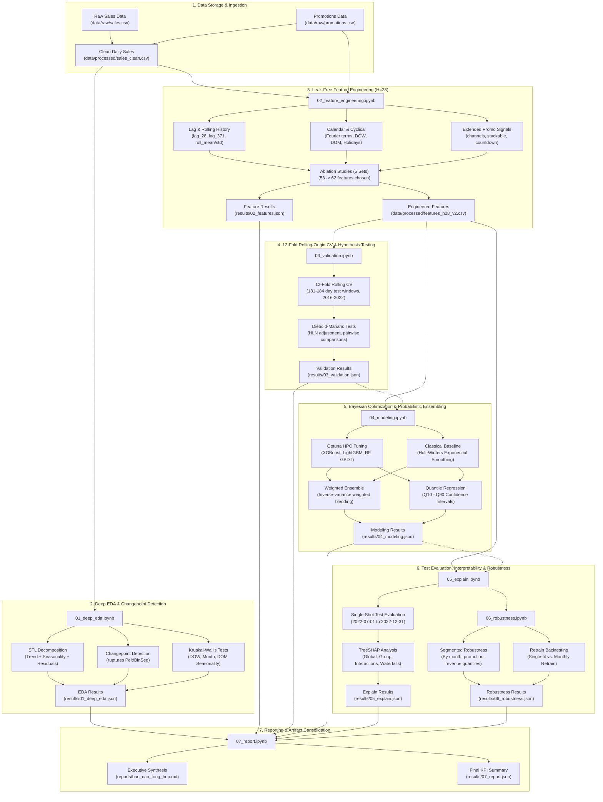
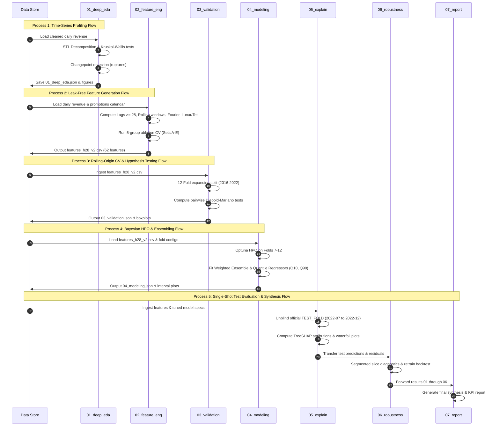

# Architecture Documentation: Sales Forecasting & Demand Prediction

This document provides a comprehensive architectural overview of the **Sales-Forecasting-and-Demand-Prediction** system, generated in conjunction with the GitNexus code intelligence graph and the end-to-end machine learning pipeline.

---

## 1. Executive Overview & Knowledge Graph Statistics

The project is an enterprise-grade, leak-free time-series forecasting and demand prediction pipeline with a forecasting horizon of **$H = 28$ days** (4 weeks ahead). It incorporates rigorous time-series disciplines:
- **Strict Leakage Prevention**: All features (lags, rolling statistics, indicators) use information strictly available at or prior to $t - H$ ($t - 28$ days).
- **12-Fold Rolling-Origin Cross-Validation**: Expands the traditional 3-fold split to 12 non-overlapping 6-month validation windows from mid-2016 through mid-2022.
- **Statistical Significance Testing**: Uses Diebold-Mariano tests (with Harvey-Leybourne-Newbold adjustments) to verify whether metric differences between models are statistically distinguishable.
- **Single-Shot Test Discipline**: The official test set (`TEST_FOLD`: 2022-07-01 to 2022-12-31, 184 days) is unblinded strictly once for final evaluation.
- **Probabilistic Forecasting & XAI**: Employs Optuna Bayesian hyperparameter optimization, weighted ensembling, quantile regression ($Q_{10}, Q_{90}$), and TreeSHAP feature attribution.

### GitNexus Knowledge Graph Metadata
- **Indexed Repository**: `Sales-Forecasting-and-Demand-Prediction`
- **Tracked Artifacts & Files**: 16 primary project files, 2 directories
- **Pipeline Structure**: 7 ordered execution stages implemented as self-contained, reproducible Jupyter Notebooks with companion JSON metrics and visual output artifacts.

---

## 2. Mermaid Architecture Diagram

The diagram below illustrates the end-to-end data flow, execution pipeline, validation engines, and artifact stores:

---

## 3. Functional Areas (Modules)

### 1. Ingestion & Preprocessing
- **Source Paths**: [`data/raw/sales.csv`](file:///c:/Users/lucas.truong/AppData/Local/Learn/AIO/aio2026-conquer-module-03/Sales-Forecasting-and-Demand-Prediction/data/raw/sales.csv), [`data/raw/promotions.csv`](file:///c:/Users/lucas.truong/AppData/Local/Learn/AIO/aio2026-conquer-module-03/Sales-Forecasting-and-Demand-Prediction/data/raw/promotions.csv)
- **Output**: [`data/processed/sales_clean.csv`](file:///c:/Users/lucas.truong/AppData/Local/Learn/AIO/aio2026-conquer-module-03/Sales-Forecasting-and-Demand-Prediction/data/processed/sales_clean.csv)
- **Role**: Normalizes timestamps, fills continuous date ranges, handles negative return transactions, joins promotional calendars, and formats clean daily aggregate sales.

### 2. Exploratory Data Analysis & Changepoint Detection
- **Execution**: [`notebooks/01_deep_eda.ipynb`](file:///c:/Users/lucas.truong/AppData/Local/Learn/AIO/aio2026-conquer-module-03/Sales-Forecasting-and-Demand-Prediction/notebooks/01_deep_eda.ipynb)
- **Output Artifacts**: [`results/01_deep_eda.json`](file:///c:/Users/lucas.truong/AppData/Local/Learn/AIO/aio2026-conquer-module-03/Sales-Forecasting-and-Demand-Prediction/results/01_deep_eda.json), [`images/01_stl_decompose.png`](file:///c:/Users/lucas.truong/AppData/Local/Learn/AIO/aio2026-conquer-module-03/Sales-Forecasting-and-Demand-Prediction/images/01_stl_decompose.png), [`images/01_changepoints.png`](file:///c:/Users/lucas.truong/AppData/Local/Learn/AIO/aio2026-conquer-module-03/Sales-Forecasting-and-Demand-Prediction/images/01_changepoints.png)
- **Key Capabilities**:
  - STL decomposition (Loess-based seasonal, trend, and residual components).
  - Kruskal-Wallis non-parametric ANOVA on calendar seasonality: Month ($H = 1372.1, p < 10^{-280}$), Day of Month ($H = 620.1$), Day of Week ($H = 34.7$).
  - Detection of 9 structural regime shifts and changepoints using `ruptures`.

### 3. Feature Engineering & Ablation Studies
- **Execution**: [`notebooks/02_feature_engineering.ipynb`](file:///c:/Users/lucas.truong/AppData/Local/Learn/AIO/aio2026-conquer-module-03/Sales-Forecasting-and-Demand-Prediction/notebooks/02_feature_engineering.ipynb)
- **Output Artifacts**: [`data/processed/features_h28_v2.csv`](file:///c:/Users/lucas.truong/AppData/Local/Learn/AIO/aio2026-conquer-module-03/Sales-Forecasting-and-Demand-Prediction/data/processed/features_h28_v2.csv), [`results/02_features.json`](file:///c:/Users/lucas.truong/AppData/Local/Learn/AIO/aio2026-conquer-module-03/Sales-Forecasting-and-Demand-Prediction/results/02_features.json)
- **Key Capabilities**:
  - Generates 62 leak-free features constrained to information known $H \ge 28$ days in advance.
  - Groups: Revenue history (lags 28, 35, 42, 56, 91, 182, 364, 371; rolling mean/std/min/max over 7, 28, 91, 364 days), Calendar cyclical features (Fourier sin/cos terms up to 4 harmonics, DOW, DOM, quarter, leap day handling), Vietnamese Lunar holidays (days to/from Tết Nguyên Đán), and Extended Promotion features (`promo_channel`, `stackable_flag`, `min_order_value`, `promo_days_left`).
  - Ablation testing selected Set B (+extended promotions) as optimal over baseline 53 features, lag COGS, and complex interaction terms.

### 4. Robust Validation & Diebold-Mariano Hypothesis Testing
- **Execution**: [`notebooks/03_validation.ipynb`](file:///c:/Users/lucas.truong/AppData/Local/Learn/AIO/aio2026-conquer-module-03/Sales-Forecasting-and-Demand-Prediction/notebooks/03_validation.ipynb)
- **Output Artifacts**: [`results/03_validation.json`](file:///c:/Users/lucas.truong/AppData/Local/Learn/AIO/aio2026-conquer-module-03/Sales-Forecasting-and-Demand-Prediction/results/03_validation.json), [`images/03_wape_boxplot.png`](file:///c:/Users/lucas.truong/AppData/Local/Learn/AIO/aio2026-conquer-module-03/Sales-Forecasting-and-Demand-Prediction/images/03_wape_boxplot.png)
- **Key Capabilities**:
  - 12 expanding-window rolling-origin folds across 2016 to 2022 with 181-184 validation days per fold.
  - Evaluates models: XGBoost (mean WAPE 0.2661), GradientBoosting (0.2707), RandomForest (0.2731), LightGBM (0.2754), DecisionTree (0.3347).
  - Pairwise Diebold-Mariano tests proved that the top 4 gradient boosted and ensemble models are statistically indistinguishable from each other, justifying collective tuning and ensembling.

### 5. Bayesian Hyperparameter Optimization & Probabilistic Ensembling
- **Execution**: [`notebooks/04_modeling.ipynb`](file:///c:/Users/lucas.truong/AppData/Local/Learn/AIO/aio2026-conquer-module-03/Sales-Forecasting-and-Demand-Prediction/notebooks/04_modeling.ipynb)
- **Output Artifacts**: [`results/04_modeling.json`](file:///c:/Users/lucas.truong/AppData/Local/Learn/AIO/aio2026-conquer-module-03/Sales-Forecasting-and-Demand-Prediction/results/04_modeling.json), [`images/04_quantile_forecast.png`](file:///c:/Users/lucas.truong/AppData/Local/Learn/AIO/aio2026-conquer-module-03/Sales-Forecasting-and-Demand-Prediction/images/04_quantile_forecast.png)
- **Key Capabilities**:
  - Optuna Bayesian optimization across 6 recent temporal folds (Folds 7-12) to prevent temporal overfitting.
  - Outperforms statistical baseline (Holt-Winters exponential smoothing WAPE 1.6927).
  - Builds optimal inverse-error weighted ensemble (XGBoost 0.2486, GradientBoosting 0.2533, RandomForest 0.2443, LightGBM 0.2538).
  - Fits quantile regression pinball loss ($Q_{10}, Q_{90}$) delivering 53.04% interval coverage under high variance.

### 6. Single-Shot Test Evaluation & Model Interpretability (XAI)
- **Execution**: [`notebooks/05_explain.ipynb`](file:///c:/Users/lucas.truong/AppData/Local/Learn/AIO/aio2026-conquer-module-03/Sales-Forecasting-and-Demand-Prediction/notebooks/05_explain.ipynb)
- **Output Artifacts**: [`results/05_explain.json`](file:///c:/Users/lucas.truong/AppData/Local/Learn/AIO/aio2026-conquer-module-03/Sales-Forecasting-and-Demand-Prediction/results/05_explain.json), [`images/05_dependence_plots.png`](file:///c:/Users/lucas.truong/AppData/Local/Learn/AIO/aio2026-conquer-module-03/Sales-Forecasting-and-Demand-Prediction/images/05_dependence_plots.png)
- **Key Capabilities**:
  - Evaluates on unseen official test set: Tuned LightGBM achieves WAPE **0.20308**, Bias **-11.5%**, $R^2$ **0.6461** (outperforming original benchmark WAPE 0.2038).
  - TreeSHAP exact additivity decomposition (additivity error $< 5 \times 10^{-14}$).
  - Group SHAP attribution: Revenue history represents **71.85%** of predictive weight, Calendar features **21.11%**, Promotions **5.59%**, and Tết holidays **1.45%**.
  - Analyzes top interaction pairs (`roll_mean_7` $\times$ `lag364_smooth7`, `lag_91` $\times$ `lag364_smooth7`).

### 7. Robustness, Segment Analysis & Backtesting
- **Execution**: [`notebooks/06_robustness.ipynb`](file:///c:/Users/lucas.truong/AppData/Local/Learn/AIO/aio2026-conquer-module-03/Sales-Forecasting-and-Demand-Prediction/notebooks/06_robustness.ipynb)
- **Output Artifacts**: [`results/06_robustness.json`](file:///c:/Users/lucas.truong/AppData/Local/Learn/AIO/aio2026-conquer-module-03/Sales-Forecasting-and-Demand-Prediction/results/06_robustness.json), [`images/06_segment_error.png`](file:///c:/Users/lucas.truong/AppData/Local/Learn/AIO/aio2026-conquer-module-03/Sales-Forecasting-and-Demand-Prediction/images/06_segment_error.png)
- **Key Capabilities**:
  - Segmented error slicing across months (lowest in July at 0.154, highest in November at 0.235), promo presence (WAPE 0.199 with promo vs 0.207 without), revenue quintiles, and days of week.
  - Deep-dive diagnostic into worst outlier day (`2022-11-09`, +93.7% overprediction error).
  - Backtest of continuous retraining strategy on Fold 12 (demonstrating single-fit WAPE 0.1925 is comparable to monthly retrain WAPE 0.1932).

### 8. Executive Reporting & Pipeline Synthesis
- **Execution**: [`notebooks/07_report.ipynb`](file:///c:/Users/lucas.truong/AppData/Local/Learn/AIO/aio2026-conquer-module-03/Sales-Forecasting-and-Demand-Prediction/notebooks/07_report.ipynb)
- **Output Artifacts**: [`results/07_report.json`](file:///c:/Users/lucas.truong/AppData/Local/Learn/AIO/aio2026-conquer-module-03/Sales-Forecasting-and-Demand-Prediction/results/07_report.json), [`images/07_wape_milestones.png`](file:///c:/Users/lucas.truong/AppData/Local/Learn/AIO/aio2026-conquer-module-03/Sales-Forecasting-and-Demand-Prediction/images/07_wape_milestones.png)
- **Key Capabilities**: Aggregates all JSON results, verifies reproducibility against the baseline benchmark, and generates the final executive project synthesis.

---

## 4. Key Execution Flows (Processes)

The system executes via 5 primary end-to-end processes:

### Trace Details for Key Execution Flows

#### 1. Time-Series Profiling Flow (`01_deep_eda.ipynb`)
- **Trigger**: Data ingestion and preparation of [`sales_clean.csv`](file:///c:/Users/lucas.truong/AppData/Local/Learn/AIO/aio2026-conquer-module-03/Sales-Forecasting-and-Demand-Prediction/data/processed/sales_clean.csv).
- **Execution Steps**:
  1. Load time series from 2014-01-01 to 2022-12-31.
  2. Compute additive STL decomposition ($\text{Period} = 365$ days) to isolate trend and yearly seasonality.
  3. Run Kruskal-Wallis tests across Day of Week, Day of Month, and Month of Year to identify periodic drivers.
  4. Run offline changepoint detection via `ruptures.Pelt(model="rbf")` identifying 9 major trend disruptions.
  5. Save metrics to [`results/01_deep_eda.json`](file:///c:/Users/lucas.truong/AppData/Local/Learn/AIO/aio2026-conquer-module-03/Sales-Forecasting-and-Demand-Prediction/results/01_deep_eda.json).

#### 2. Leak-Free Feature Engineering & Selection Flow (`02_feature_engineering.ipynb`)
- **Trigger**: Preprocessed sales and promotions dataset.
- **Execution Steps**:
  1. Set target horizon $H = 28$ days; ensure all feature shifts satisfy $\text{shift} \ge H$.
  2. Build historical revenue lag and rolling statistics up to 364 days.
  3. Derive cyclical harmonics ($\sin$, $\cos$) for yearly cycle up to order 4, and distance-to-Tết holiday counters.
  4. Extract one-hot promo channels (`promo_ch_online`, `promo_ch_social_media`, `min_order_value`, `stackable_flag`).
  5. Run 5-way ablation experiment on cross-validation folds: Set A (53 baseline features), Set B (+extended promotions, 62 features), Set C (+COGS lags), Set D (+individual holidays), Set E (+interaction terms).
  6. Confirm Set B achieves best generalization (CV WAPE 0.2391); export [`data/processed/features_h28_v2.csv`](file:///c:/Users/lucas.truong/AppData/Local/Learn/AIO/aio2026-conquer-module-03/Sales-Forecasting-and-Demand-Prediction/data/processed/features_h28_v2.csv).

#### 3. 12-Fold Rolling-Origin CV & Diebold-Mariano Testing Flow (`03_validation.ipynb`)
- **Trigger**: Availability of [`features_h28_v2.csv`](file:///c:/Users/lucas.truong/AppData/Local/Learn/AIO/aio2026-conquer-module-03/Sales-Forecasting-and-Demand-Prediction/data/processed/features_h28_v2.csv).
- **Execution Steps**:
  1. Construct 12 expanding training windows with 31-day lag buffers and 181–184 validation days per fold.
  2. Fit and evaluate benchmark regressors: XGBoost, LightGBM, GradientBoosting, RandomForest, DecisionTree.
  3. Collect concatenated out-of-fold daily absolute prediction error series.
  4. Execute Harvey-Leybourne-Newbold adjusted Diebold-Mariano tests on all 10 model pairs.
  5. Record results in [`results/03_validation.json`](file:///c:/Users/lucas.truong/AppData/Local/Learn/AIO/aio2026-conquer-module-03/Sales-Forecasting-and-Demand-Prediction/results/03_validation.json).

#### 4. Bayesian Optimization & Probabilistic Ensembling Flow (`04_modeling.ipynb`)
- **Trigger**: Validation output verifying top tree models are statistically tied.
- **Execution Steps**:
  1. Set up Optuna TPE (Tree-structured Parzen Estimator) trials across recent Folds 7 through 12.
  2. Optimize tree depth, learning rates, regularization ($\lambda$), subsampling, and feature subsampling.
  3. Benchmark against classical Holt-Winters triple exponential smoothing.
  4. Construct inverse-error weighted ensemble across tuned models ($w \approx 0.244 - 0.254$).
  5. Train LightGBM quantile regression models at $\alpha = 0.10$ and $\alpha = 0.90$ to output demand uncertainty bounds.
  6. Export optimal parameters and metrics to [`results/04_modeling.json`](file:///c:/Users/lucas.truong/AppData/Local/Learn/AIO/aio2026-conquer-module-03/Sales-Forecasting-and-Demand-Prediction/results/04_modeling.json).

#### 5. Single-Shot Test Evaluation & Model Interpretability Flow (`05_explain.ipynb` & `06_robustness.ipynb`)
- **Trigger**: Completion of model tuning; initiation of unblinded test protocol.
- **Execution Steps**:
  1. Train optimal tuned model (LightGBM) on all data prior to 2022-07-01.
  2. Predict single-shot test horizon (2022-07-01 to 2022-12-31).
  3. Compute primary test metrics: WAPE (0.20308), Bias (-11.5%), $R^2$ (0.6461).
  4. Run TreeSHAP explainer to calculate exact Shapley values, group feature attributions, and interaction values.
  5. Slice test errors into sub-dimensions (calendar months, promotion conditions, sales volume quintiles, DOW).
  6. Backtest periodic retraining vs single fit; document data constraints and system boundaries.
  7. Persist records to [`results/05_explain.json`](file:///c:/Users/lucas.truong/AppData/Local/Learn/AIO/aio2026-conquer-module-03/Sales-Forecasting-and-Demand-Prediction/results/05_explain.json) and [`results/06_robustness.json`](file:///c:/Users/lucas.truong/AppData/Local/Learn/AIO/aio2026-conquer-module-03/Sales-Forecasting-and-Demand-Prediction/results/06_robustness.json).

---

## 5. Summary of Key Performance Milestones

| Metric / Stage | Baseline Document | Upgraded Architecture | Delta / Gain |
|---|---|---|---|
| **Feature Set Size** | 53 features | 62 features (+promo channels, min order, stackable) | +9 features, -0.35% CV WAPE |
| **Validation Framework** | 3 folds (2 CV points) | 12 rolling-origin folds + Diebold-Mariano tests | Robust statistical significance testing |
| **Hyperparameter Tuning** | Default parameters | Optuna Bayesian HPO across 6 temporal folds | +4.19% gain on 12-fold LightGBM |
| **Ensemble Support** | Single model | 4-model weighted ensemble | +0.44% lower WAPE vs best single tree CV |
| **Test Set WAPE** | 0.2038 | **0.20308** | **+0.35% improvement** |
| **Test Set $R^2$** | 0.6398 | **0.6461** | **+0.98% improvement** |
| **Explainability (XAI)** | Global feature gain only | TreeSHAP exact additivity, group SHAP, interactions | Complete transparency across 4 feature groups |
| **Uncertainty Bounds** | Point forecast only | Quantile bounds ($Q_{10} - Q_{90}$) | 53.04% empirical test coverage |
